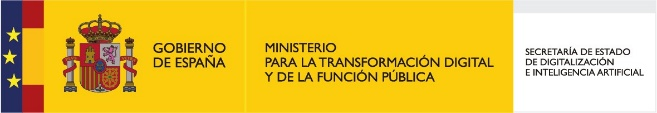
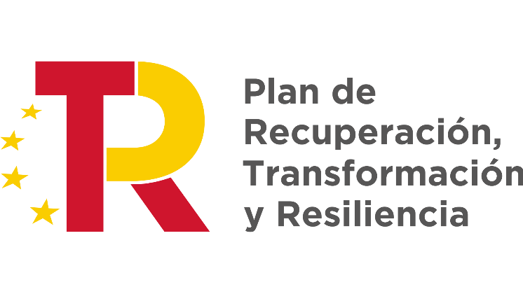

# iaDoc - Plataforma de Documentación Inteligente

<p align="center">
  
  
  
  
</p>

## 📋 Descripción del Proyecto

**iaDoc** es una plataforma integral de documentación inteligente que combina las capacidades de múltiples tecnologías de IA para proporcionar una solución completa de gestión documental, automatización de flujos de trabajo y colaboración empresarial. El proyecto integra herramientas como AppFlowy (editor colaborativo), N8N (automatización de flujos), Open WebUI (interfaz de IA) y Ollama (modelos de lenguaje local).

### 🎯 Objetivos Principales

- **Automatización Inteligente**: Implementación de flujos de trabajo automatizados para la gestión de inventarios y documentación
- **IA Local**: Integración de modelos de lenguaje que funcionan localmente sin depender de servicios externos
- **Colaboración**: Plataforma colaborativa para equipos de trabajo con AppFlowy
- **Escalabilidad**: Arquitectura basada en contenedores Docker para facilitar el despliegue y escalado

## 🏗️ Arquitectura del Sistema

El proyecto está estructurado con una arquitectura de microservicios utilizando Docker Compose:

### Componentes Principales

#### 🤖 **Servicios de IA**
- **Ollama** (puerto 7869): Motor de inferencia de modelos de IA locales
- **Open WebUI** (puerto 8080): Interfaz web para interactuar con los modelos de IA
- **AppFlowy AI**: Servicio de IA específico para las funcionalidades de AppFlowy

#### 🔄 **Automatización**
- **N8N** (puerto 5678): Plataforma de automatización de flujos de trabajo
- **AppFlowy Worker**: Procesador de tareas en segundo plano

#### 📝 **Documentación y Colaboración**
- **AppFlowy Cloud**: Backend del sistema de documentación colaborativa
- **AppFlowy Web**: Interfaz web de AppFlowy
- **Admin Frontend**: Panel de administración

#### 🗄️ **Base de Datos y Almacenamiento**
- **PostgreSQL**: Base de datos principal con extensión pgvector para búsquedas vectoriales
- **Redis**: Cache y gestión de sesiones
- **MinIO**: Almacenamiento de objetos S3-compatible
- **PgAdmin**: Interfaz de administración de PostgreSQL

#### 🌐 **Infraestructura Web**
- **Nginx**: Reverse proxy y servidor web
- **GoTrue**: Servicio de autenticación

## 📁 Estructura del Proyecto

```
iaDoc/
├── assets/                 # Recursos gráficos y logos
├── dummy-data/            # Datos de prueba y backups
├── envs/                  # Configuraciones de entorno
│   ├── dev/              # Entorno de desarrollo
│   └── prod/             # Entorno de producción
├── hardware/             # Documentación de hardware recomendado
└── src/                  # Código fuente
    ├── appflowy/         # Submodule de AppFlowy
    ├── n8n/              # Configuraciones y flujos de N8N
    │   ├── config/       # Configuración de N8N
    │   ├── credentials/  # Credenciales exportadas
    │   ├── scripts/      # Scripts personalizados (ej: SpeechToText.py)
    │   └── workflows/    # Flujos de trabajo de N8N
    └── nginx/            # Configuración del proxy reverso
        ├── conf/         # Archivos de configuración
        └── public/       # Archivos estáticos
```

## 🚀 Instalación y Configuración

### Requisitos del Sistema

#### Hardware Mínimo
- **CPU**: 8 cores (recomendado)
- **RAM**: 16GB (32GB recomendado para modelos de IA grandes)
- **Almacenamiento**: 100GB SSD disponible
- **GPU**: NVIDIA GPU compatible con CUDA (opcional pero recomendado para IA)

#### Software
- Docker 24.0+
- Docker Compose 2.0+
- Make
- Git

### Instalación

1. **Clonar el repositorio**:
```bash
git clone https://github.com/DevAlteria/iaDoc.git
cd iaDoc
```

2. **Inicializar submódulos**:
```bash
git submodule update --init --recursive
```

3. **Configurar variables de entorno**:
```bash
cp envs/dev/deploy.env envs/dev/.env
# Editar envs/dev/.env con tus configuraciones específicas
```

4. **Construir y ejecutar el proyecto**:
```bash
make up
```

### Comandos Make Disponibles

- `make up`: Construye y levanta todos los servicios
- `make down`: Detiene todos los servicios
- `make build`: Construye las imágenes Docker
- `make clean`: Limpia volúmenes de datos
- `make logs`: Muestra los logs de todos los servicios
- `make ps`: Lista el estado de los contenedores

#### Gestión de N8N
- `make n8n-export-workflows`: Exporta flujos de trabajo de N8N
- `make n8n-export-credentials`: Exporta credenciales de N8N

#### Gestión de AppFlowy
- `make appflowy-export`: Exporta datos de AppFlowy
- `make appflowy-import`: Importa datos de AppFlowy
- `make appflowy-clean`: Limpia datos de AppFlowy

## 🔧 Configuración de Servicios

### N8N - Automatización de Flujos

N8N está preconfigurado con varios flujos de trabajo importantes:

- **Inventory Question**: Flujo principal para consultas de inventario
- **CSV**: Procesamiento de archivos CSV
- **Speech to Text**: Conversión de audio a texto

#### Configuración Personalizada
- Archivo de configuración: `src/n8n/config/config.json`
- Scripts personalizados: `src/n8n/scripts/`
- Credenciales: `src/n8n/credentials/`

### AppFlowy - Documentación Colaborativa

AppFlowy proporciona un entorno de documentación similar a Notion, con capacidades de:
- Edición colaborativa en tiempo real
- Gestión de bases de datos
- Integración con IA para asistencia en escritura

### Ollama - Modelos de IA Local

Ollama permite ejecutar modelos de lenguaje localmente:
- Compatible con modelos Llama, Mistral, CodeLlama, etc.
- API REST para integración con otras aplicaciones
- Optimizado para hardware con y sin GPU

## 🌐 Acceso a los Servicios

Una vez desplegado, los servicios estarán disponibles en:

- **Página Principal**: http://iadoc.alteria.vpn.alonsom.com/
- **Open WebUI (IA)**: http://iadoc.alteria.vpn.alonsom.com/webui
- **N8N (Automatización)**: http://iadoc.alteria.vpn.alonsom.com/n8n
- **AppFlowy**: http://appflowy.iadoc.alteria.vpn.alonsom.com/
- **MinIO**: http://iadoc.alteria.vpn.alonsom.com/minio
- **PgAdmin**: Accesible a través del proxy

## 🔒 Seguridad y Autenticación

El proyecto utiliza GoTrue para la gestión de autenticación, soportando:
- Autenticación por email/contraseña
- OAuth con Google, GitHub, Discord
- SAML 2.0
- Autenticación LDAP

## 📊 Monitoreo y Logs

Para monitorear el estado del sistema:

```bash
# Ver logs en tiempo real
make logs

# Verificar estado de servicios
make ps

# Logs de un servicio específico
docker compose -f ./envs/dev/docker-compose.yml logs [nombre_servicio]
```

## 🛠️ Desarrollo y Personalización

### Añadir Nuevos Flujos de N8N
1. Crear el flujo en la interfaz web de N8N
2. Exportar usando: `make n8n-export-workflows`
3. Commit de los archivos JSON generados

### Personalizar Nginx
Editar archivos en `src/nginx/conf/http.d/` para añadir nuevas rutas o configuraciones.

### Modificar Configuración de AppFlowy
Las variables de entorno de AppFlowy se configuran en `envs/dev/deploy.env`.

## 🏢 Financiación

Este proyecto está financiado por la Unión Europea a través del programa __PERTE__ (Proyecto Estratégico para la Recuperación y Transformación Económica) dentro de __Subvenciones para uso de Inteligencia Artificial (IA) aplicada a la industria (2024)__ de la Comunidad de Madrid. 

<p align="center">
  
  
  
  
</p>

## 📄 Licencia

Ver archivo [LICENSE](LICENSE) para más detalles.

## 🤝 Contribución

Las contribuciones son bienvenidas. Por favor:
1. Fork del repositorio
2. Crear una rama para tu feature
3. Commit de tus cambios
4. Push a la rama
5. Crear un Pull Request

## 📞 Soporte

Para soporte técnico o preguntas sobre el proyecto, contactar al equipo de desarrollo de Alteria Auutomation SL.

---

**Desarrollado por Alteria Auutomation SL** | **Financiado por la Unión Europea - PERTE**
