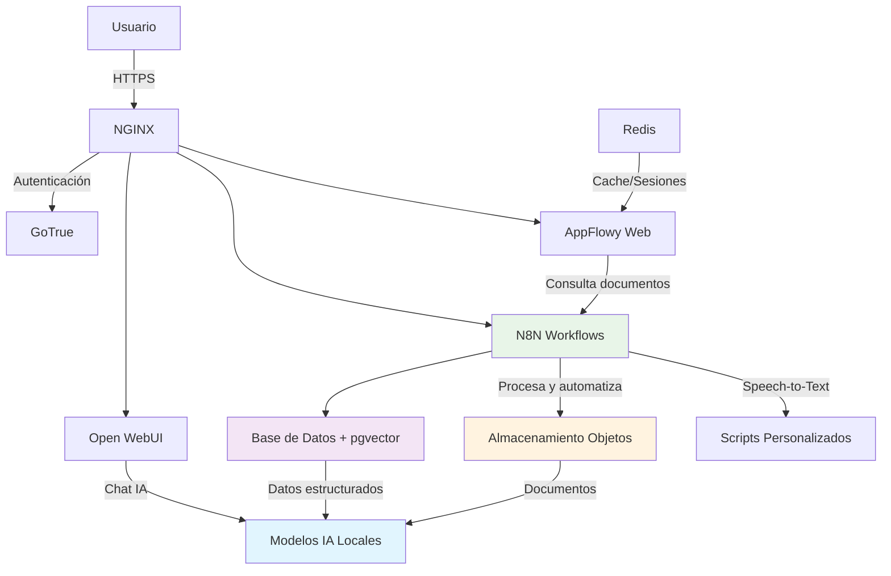

# docuAI - Plataforma de Documentación Inteligente con IA

<p align="center">
  
  
  
  
</p>

## 📋 Descripción del Proyecto

**docuAI** es una plataforma integral de documentación inteligente que integra múltiples tecnologías de IA para proporcionar una solución completa de gestión documental, automatización de flujos de trabajo y colaboración empresarial. 

El sistema permite la **interacción con documentación técnica en distintos formatos** (PDF, Excel, PNG, etc.) mediante **lenguaje natural**, combinando:

- **AppFlowy** (editor colaborativo tipo Notion)
- **N8N** (automatización de flujos de trabajo avanzados)  
- **Open WebUI** (interfaz conversacional con IA)
- **Ollama** (modelos de lenguaje que ejecutan localmente)
- **PostgreSQL con pgvector** (base de datos vectorial para búsquedas semánticas)
- **MinIO** (almacenamiento de objetos compatible S3)

### 🎯 Objetivos Principales

- **Consulta de Documentación por IA**: Permite hacer preguntas en lenguaje natural sobre documentación técnica en múltiples formatos
- **Automatización Inteligente**: Flujos de trabajo automatizados para gestión de inventarios, análisis de archivos KiCad, procesamiento de documentos
- **IA Local y Privada**: Modelos de lenguaje que funcionan completamente en local sin enviar datos a servicios externos
- **Colaboración Empresarial**: Plataforma colaborativa para equipos con capacidades de edición en tiempo real
- **Arquitectura Escalable**: Basada en microservicios con Docker para facilitar el despliegue y escalado
- **Búsquedas Semánticas**: Integración de bases de datos vectoriales para búsquedas por similitud semántica

### 🚀 Casos de Uso

- **Consulta de inventarios**: "¿Qué componentes tenemos disponibles para el proyecto X?"
- **Análisis de diseños**: Extracción automática de información de archivos KiCad
- **Conversión de audio**: Speech-to-text para documentación por voz
- **Gestión documental**: Organización y búsqueda inteligente de documentos técnicos
- **Colaboración en tiempo real**: Equipos trabajando simultáneamente en documentación

## 🏗️ Arquitectura del Sistema

El proyecto utiliza una **arquitectura de microservicios** basada en contenedores Docker, diseñada para garantizar interoperabilidad, seguridad, escalabilidad y facilidad de mantenimiento.

### Diagrama Arquitectónico



### Componentes Principales

#### 🤖 **Servicios de IA**
- **Ollama** (puerto 7869): Motor de inferencia con modelos locales
  - DeepSeek-R1 14B (razonamiento avanzado)
  - Nomic-embed-text v1.5 (embeddings)
  - All-MiniLLM-L6-v2 (modelo ligero)
- **Open WebUI** (puerto 8080): Interfaz conversacional tipo ChatGPT
- **AppFlowy AI**: Servicios de IA integrados en la plataforma colaborativa

#### 🔄 **Automatización y Flujos de Trabajo**
- **N8N** (puerto 5678): Motor de automatización con flujos especializados:
  - `CHAT`: Interfaz de chat principal
  - `HOCK - PREGUNTAS`: Manejo de consultas
  - `CHILD - RETRIVE INVENTORY`: Consultas de inventario
  - `CHILD - RETRIVE KICAD`: Análisis de archivos KiCad
  - `HOCK - INDEX INVENTORY/KICAD`: Indexación automática
  - Funciones de base de datos (`FUNC - GET/CREATE DATABASE...`)
- **Scripts Personalizados**: 
  - `SpeechToText.py`: Conversión de audio a texto
  - `gen_bom_csv_from_repo.sh`: Generación de listas de materiales

#### 📝 **Documentación y Colaboración**
- **AppFlowy Cloud**: Backend del sistema de documentación colaborativa
- **AppFlowy Web**: Interfaz web estilo Notion con edición colaborativa
- **Admin Frontend**: Panel de administración del sistema

#### 🗄️ **Almacenamiento y Base de Datos**
- **PostgreSQL con pgvector**: Base de datos principal optimizada para búsquedas vectoriales
- **Redis**: Sistema de cache y gestión de sesiones
- **MinIO**: Almacenamiento de objetos S3-compatible para documentos
- **PgAdmin**: Interfaz web de administración de PostgreSQL

#### 🌐 **Infraestructura y Seguridad**
- **Nginx**: Reverse proxy y servidor web con configuración personalizada
- **GoTrue**: Servicio de autenticación y autorización
- **Docker Compose**: Orquestación de contenedores con perfiles dev/prod

## 📁 Estructura del Proyecto

```
docuAI/
├── assets/                 # Recursos gráficos y logos institucionales
├── docs/                   # Documentación técnica del proyecto
│   └── arquitecturaCasosUso.md  # Arquitectura detallada y casos de uso
├── envs/                   # Configuraciones de entorno
│   ├── dev/               # Entorno de desarrollo
│   │   ├── deploy.env     # Variables de entorno
│   │   └── docker-compose.yml  # Orquestación de servicios
│   └── prod/              # Entorno de producción
├── hardware/              # Recomendaciones de hardware
└── src/                   # Código fuente y configuraciones
    ├── pg-servers.json    # Configuración de servidores PostgreSQL
    ├── appflowy/          # Submódulo de AppFlowy (v0.9.64)
    ├── n8n/               # Configuraciones N8N
    │   ├── config/        # Configuración principal (config.json)
    │   ├── credentials/   # Credenciales exportadas
    │   │   ├── Default.json
    │   │   ├── ollama.json
    │   │   └── Postgres account.json
    │   ├── scripts/       # Scripts personalizados
    │   │   ├── SpeechToText.py        # Conversión de audio a texto
    │   │   └── gen_bom_csv_from_repo.sh  # Generación BOM CSV
    │   └── workflows/     # Flujos de trabajo N8N
    │       ├── CHAT.json                    # Chat principal
    │       ├── HOCK - PREGUNTAS.json       # Manejo de consultas
    │       ├── CHILD - RETRIVE INVENTORY.json  # Consultas inventario
    │       ├── CHILD - RETRIVE KICAD.json     # Análisis KiCad
    │       ├── HOCK - INDEX INVENTORY.json    # Indexación inventario
    │       ├── HOCK - INDEX KICAD.json       # Indexación KiCad
    │       └── FUNC - *.json                 # Funciones de BD
    └── nginx/             # Configuración del proxy reverso
        ├── conf/          # Archivos de configuración
        │   ├── nginx.conf
        │   └── http.d/    # Configuraciones específicas por servicio
        └── public/        # Archivos estáticos web
```

## 🚀 Instalación y Configuración

### Requisitos del Sistema

#### Hardware Mínimo
- **CPU**: 8 cores (recomendado 12+ cores para modelos grandes)
- **RAM**: 16GB (32GB recomendado para DeepSeek-R1 14B)
- **Almacenamiento**: 100GB SSD disponible (200GB+ recomendado)
- **GPU**: NVIDIA GPU con 8GB+ VRAM (opcional pero recomendado para modelos grandes)
- **Red**: Conexión estable para descargas iniciales de modelos

#### Software Requerido
- **Docker** 24.0+ con Docker Compose 2.0+
- **Make** (para comandos automatizados)
- **Git** (para clonación y submódulos)
- Sistema operativo: Linux, macOS o Windows con WSL2

#### Modelos de IA Incluidos
El sistema descarga automáticamente estos modelos:
- **DeepSeek-R1 14B**: Modelo principal de reasoning y conversación
- **Nomic-embed-text v1.5**: Para generación de embeddings
- **All-MiniLLM-L6-v2**: Modelo ligero para tareas específicas

### Instalación

1. **Clonar el repositorio con submódulos**:
```bash
git clone --recursive https://github.com/DevAlteria/docuAI.git
cd docuAI
```

2. **Inicializar submódulos (si no se clonó con --recursive)**:
```bash
git submodule update --init --recursive
```

3. **Configurar variables de entorno**:
```bash
# Las variables se copian automáticamente durante el build
# Opcionalmente editar envs/dev/deploy.env para personalizar
```

4. **Construir y ejecutar el proyecto completo**:
```bash
make re
```


5. **Verificar que todos los servicios están ejecutándose**:
```bash
make ps
```

### Comandos Make Disponibles

#### Gestión Principal del Sistema
- `make up`: Construye y levanta todos los servicios
- `make down`: Detiene todos los servicios manteniendo los datos
- `make build`: Construye las imágenes Docker sin levantar servicios
- `make clean`: Limpia volúmenes de datos (⚠️ elimina todos los datos)
- `make re`: Reconstrucción completa (clean + build + up + modelos)
- `make logs`: Muestra los logs de todos los servicios
- `make ps`: Lista el estado de los contenedores

#### Gestión de Modelos de IA
- `make ollamaPull`: Descarga los modelos de IA desde el archivo models.txt

#### Gestión de N8N
- `make n8n-export-workflows`: Exporta flujos de trabajo de N8N
- `make n8n-export-credentials`: Exporta credenciales de N8N

#### Gestión de AppFlowy
- `make appflowy-export`: Exporta datos de AppFlowy (MinIO + PostgreSQL)
- `make appflowy-import`: Importa datos de AppFlowy
- `make appflowy-clean`: Limpia datos de AppFlowy completamente

## 🔧 Configuración de Servicios

### N8N - Automatización de Flujos

N8N viene preconfigurado con flujos de trabajo especializados:

#### Flujos Principales
- **CHAT**: Interfaz de chat principal para interacción con usuarios
- **HOCK - PREGUNTAS**: Manejo inteligente de consultas y preguntas
- **CHILD - RETRIVE INVENTORY**: Consultas especializadas de inventario
- **CHILD - RETRIVE KICAD**: Análisis automático de archivos de diseño KiCad
- **HOCK - INDEX INVENTORY/KICAD**: Indexación automática de documentos

#### Funciones de Base de Datos
- **FUNC - GET/CREATE DATABASE**: Operaciones CRUD sobre bases de datos
- **GET DATABASE ROW**: Recuperación de filas específicas
- **CREATE DATA - INIT**: Inicialización de estructuras de datos

#### Scripts Personalizados
- **SpeechToText.py**: Conversión automática de audio (.oga) a texto en español
- **gen_bom_csv_from_repo.sh**: Generación de listas de materiales desde repositorios

#### Configuración Personalizada
- **Archivo principal**: `src/n8n/config/config.json`
- **Credenciales**: `src/n8n/credentials/` (exportadas y gestionadas automáticamente)
- **Timeout**: 3600 segundos para procesos largos
- **Concurrencia**: Sin límites para entorno de producción
- **IA habilitada**: Funciones de IA integradas

### AppFlowy - Documentación Colaborativa

AppFlowy proporciona un entorno de documentación colaborativa tipo Notion:

#### Características Principales
- **Edición colaborativa en tiempo real** con múltiples usuarios
- **Gestión de bases de datos** integrada con PostgreSQL
- **Integración con IA** para asistencia en escritura y análisis
- **Workspaces personalizables** para diferentes equipos o proyectos
- **Historial de versiones** y control de cambios

#### Configuración
- **Dominio**: Configurable via `FQDN` en deploy.env
- **Autenticación**: Integrada con GoTrue
- **Almacenamiento**: MinIO para archivos adjuntos
- **Base de datos**: PostgreSQL con pgvector para búsquedas semánticas

### Ollama - Modelos de IA Local

Ollama ejecuta modelos de lenguaje completamente en local:

#### Modelos Incluidos
- **DeepSeek-R1 14B**: Modelo principal con capacidades de reasoning avanzado
- **Nomic-embed-text v1.5**: Generación de embeddings para búsquedas semánticas  
- **All-MiniLLM-L6-v2**: Modelo ligero para tareas específicas

#### Características
- **API REST** compatible con OpenAI para integración
- **Optimización automática** para hardware con y sin GPU
- **Gestión de memoria** inteligente con keep-alive configurable
- **Sin dependencias externas** - funciona completamente offline

## 🌐 Acceso a los Servicios

Una vez desplegado, los servicios estarán disponibles en las siguientes URLs:

### Servicios Principales
- **🏠 Página Principal**: http://localhost
- **🤖 Open WebUI (Chat IA)**: http://localhost/webui
- **⚡ N8N (Automatización)**: http://localhost/n8n
- **📝 AppFlowy (Documentación)**: http://appflowy.localhost

### Servicios de Administración
- **🗄️ MinIO (Almacenamiento)**: http://localhost/minio
- **🐘 PgAdmin (Base de Datos)**: Accesible a través del proxy
- **📊 Ollama API**: http://localhost:7869/api

### Credenciales por Defecto
- **MinIO**: `minioadmin` / `minioadmin`
- **PostgreSQL**: Ver `envs/dev/deploy.env` para credenciales configuradas
- **N8N**: Configuración inicial requerida en primer acceso

> ⚠️ **Nota**: Las URLs mostradas son para el entorno de desarrollo. En producción, cambiar por el dominio real configurado en `deploy.env`.

## 🔒 Seguridad y Autenticación

El proyecto utiliza **GoTrue** como servicio de autenticación centralizada, proporcionando:

### Métodos de Autenticación Soportados
- **Email/Contraseña**: Autenticación tradicional con verificación de email
- **OAuth Providers**: Google, GitHub, Discord
- **SAML 2.0**: Para integración empresarial
- **LDAP**: Conexión con directorios corporativos

### Características de Seguridad
- **JWT Tokens**: Sesiones seguras con tokens de 168 horas de duración
- **Refresh Tokens**: Renovación automática de sesiones
- **Rate Limiting**: Protección contra ataques de fuerza bruta
- **HTTPS**: Comunicación cifrada entre servicios (configurable)

### Configuración de Seguridad
La configuración de autenticación se encuentra en:
- `envs/dev/deploy.env`: Variables de entorno de GoTrue
- `src/n8n/config/config.json`: Configuración de autenticación N8N

> 🔐 **Recomendación**: En producción, cambiar todas las contraseñas por defecto y habilitar HTTPS

## 📊 Monitoreo y Troubleshooting

### Comandos de Monitoreo

```bash
# Ver logs en tiempo real de todos los servicios
make logs

# Verificar estado de todos los contenedores
make ps

# Logs de un servicio específico
docker compose -f ./envs/dev/docker-compose.yml logs [nombre_servicio]

# Seguir logs en tiempo real de un servicio
docker compose -f ./envs/dev/docker-compose.yml logs -f [nombre_servicio]

# Ver uso de recursos
docker stats
```

### Servicios Clave a Monitorear
- **ollama**: Consumo de GPU/CPU para modelos de IA
- **postgres**: Uso de memoria y conexiones de base de datos
- **n8n**: Ejecución de flujos de trabajo
- **minio**: Almacenamiento de objetos
- **nginx**: Proxy y acceso web

### Troubleshooting Común

#### Problema: Ollama no carga modelos
```bash
# Verificar modelos descargados
docker exec ollama ollama list

# Descargar modelos manualmente
make ollamaPull
```

#### Problema: N8N no responde
```bash
# Reiniciar solo N8N
docker compose -f ./envs/dev/docker-compose.yml restart n8n

# Verificar configuración
docker exec n8n cat /home/node/.n8n/config/config.json
```

#### Problema: AppFlowy no conecta a BD
```bash
# Verificar PostgreSQL
docker compose -f ./envs/dev/docker-compose.yml logs postgres

# Verificar conectividad
docker exec postgres pg_isready
```

## 🛠️ Desarrollo y Personalización

### Añadir Nuevos Flujos de N8N
1. **Crear el flujo** en la interfaz web de N8N (puerto 5678)
2. **Probar el flujo** en el entorno de desarrollo
3. **Exportar automáticamente**: `make n8n-export-workflows`
4. **Commit** de los archivos JSON generados en `src/n8n/workflows/`

### Personalizar Scripts de Python
1. **Editar scripts** en `src/n8n/scripts/`
2. **Ejemplo - Modificar SpeechToText.py**:
   - Cambiar idioma: `language='es-ES'` por otro código
   - Añadir nuevos formatos de audio
   - Implementar filtros de ruido

### Configurar Nginx
1. **Añadir nuevas rutas**: Editar archivos en `src/nginx/conf/http.d/`
2. **Ejemplo - Nueva ruta**:
```nginx
location /mi-servicio/ {
    proxy_pass http://mi-servicio:puerto/;
    proxy_set_header Host $host;
}
```
3. **Reiniciar**: `docker compose restart nginx`

### Modificar Modelos de IA
1. **Editar** `models.txt` con nuevos modelos
2. **Descargar**: `make ollamaPull`
3. **Modelos disponibles**: Ver https://ollama.ai/library

### Personalizar AppFlowy
- **Variables de entorno**: Editar `envs/dev/deploy.env`
- **Configuración de workspace**: Via interfaz web
- **Integraciones**: Configurar webhooks y APIs

### Desarrollo con Hot Reload
```bash
# Solo para desarrollo - recarga automática de cambios
docker compose -f ./envs/dev/docker-compose.yml up -d --build
```

## 🏢 Financiación

Este proyecto está financiado por la Unión Europea a través del programa __PERTE__ (Proyecto Estratégico para la Recuperación y Transformación Económica) dentro de __Subvenciones para uso de Inteligencia Artificial (IA) aplicada a la industria (2024)__ de la Comunidad de Madrid. 

<p align="center">
  
  
  
  
</p>

## 📄 Licencia

Este proyecto está licenciado bajo la **Licencia MIT**. Ver archivo [LICENSE](LICENSE) para más detalles.

### Componentes de Terceros
- **AppFlowy**: Apache License 2.0
- **N8N**: Sustainable Use License
- **Ollama**: MIT License
- **PostgreSQL**: PostgreSQL License
- **MinIO**: GNU AGPL v3

## 🤝 Contribución

Las contribuciones son bienvenidas y apreciadas. Para contribuir:

### Proceso de Contribución
1. **Fork** del repositorio
2. **Crear rama** para tu feature: `git checkout -b feature/nueva-funcionalidad`
3. **Desarrollar** y probar tus cambios
4. **Commit** con mensajes descriptivos
5. **Push** a tu rama: `git push origin feature/nueva-funcionalidad`
6. **Crear Pull Request** con descripción detallada

### Áreas de Contribución
- 🚀 **Nuevos flujos N8N** para casos de uso específicos
- 🔧 **Scripts de automatización** adicionales
- 📝 **Mejoras en documentación** y tutoriales
- 🐛 **Corrección de bugs** y optimizaciones
- 🌐 **Traducciones** a otros idiomas
- 🧪 **Tests** y validaciones automáticas

### Estándares de Código
- **Commits semánticos**: `feat:`, `fix:`, `docs:`, etc.
- **Documentación**: Actualizar README.md si es necesario
- **Testing**: Verificar que todos los servicios funcionan tras cambios

## 📞 Soporte y Contacto

### Soporte Técnico
Para soporte técnico, preguntas sobre el proyecto o reportar issues:

- **Email**: dev@alteriaautomation.com
- **Issues**: [GitHub Issues](https://github.com/DevAlteria/docuAI/issues)
- **Documentación**: Ver carpeta `docs/` para documentación técnica detallada

### Reportar Problemas
Al reportar un problema, incluir:
- **Versión** del sistema operativo
- **Logs** relevantes (`make logs`)
- **Pasos** para reproducir el problema
- **Configuración** utilizada

### Solicitudes de Funcionalidades
Para solicitar nuevas funcionalidades:
1. **Verificar** que no existe un issue similar
2. **Describir** el caso de uso y beneficios
3. **Proponer** implementación si es posible

---

<div align="center">

**Desarrollado por [Alteria Automation SL](https://alteriaautomation.com)** 

**Financiado por la Unión Europea - Programa PERTE**

*"Proyecto estratégico para la Recuperación y Transformación Económica"*

</div>
