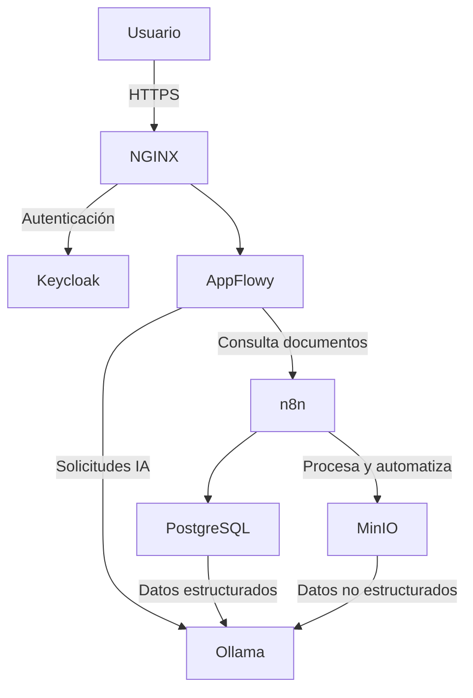
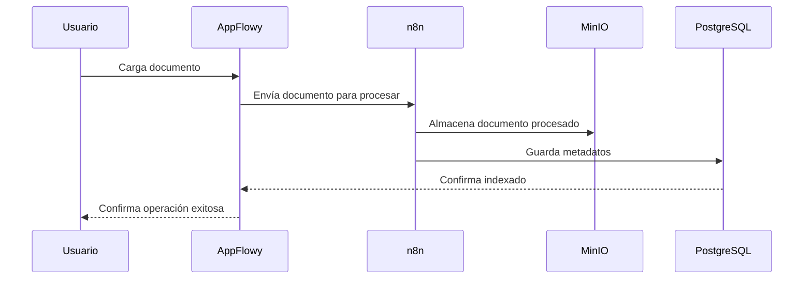
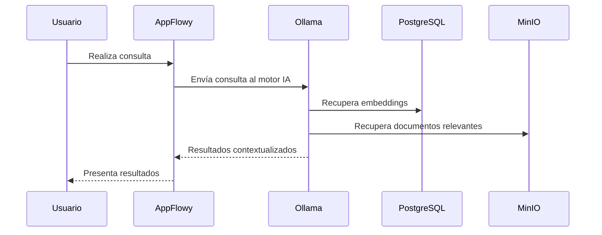
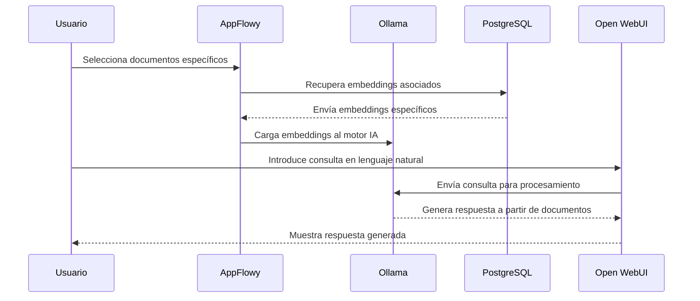

## Documento de Arquitectura de Referencia y Casos de Uso

### Arquitectura de Referencia

La arquitectura de referencia del proyecto docuAI está diseñada para integrar componentes tecnológicos avanzados, garantizando la interoperabilidad, seguridad, escalabilidad y facilidad de mantenimiento para interactuar con lenguaje natural con documentacion tecnica en distintos formatos (pdf, excel, png, ...).

#### Componentes Principales

* **Frontend**: AppFlowy
* **Backend IA**: Ollama, Open WebUI
* **Automatización**: n8n
* **Base de datos estructurada**: PostgreSQL con pgvector
* **Base de datos no estructurada**: MinIO
* **Autenticación y Autorización**: Keycloak
* **Proxy reverso**: NGINX

#### Diagrama Arquitectónico (Mermaid)

### Casos de Uso

#### Caso de Uso 1: Carga y Clasificación Automática de Documentos

* **Actor principal**: Ingeniero o técnico de ALTERIA
* **Descripción**: El usuario carga documentos al sistema y este automáticamente los clasifica e indexa.

##### Flujo principal:

1. Usuario carga documentos desde la interfaz AppFlowy.
2. El sistema (n8n) indexa y procesa automáticamente los documentos.
3. Documentos procesados se almacenan en MinIO y metadatos en PostgreSQL.

##### Diagrama (Mermaid)

#### Caso de Uso 2: Búsqueda Inteligente de Documentos

* **Actor principal**: Usuario técnico de ALTERIA
* **Descripción**: El usuario realiza búsquedas en lenguaje natural y el sistema recupera documentos relevantes mediante IA.

##### Flujo principal:

1. Usuario introduce consulta en AppFlowy.
2. La consulta pasa al motor de IA (Ollama).
3. El motor busca en PostgreSQL mediante embeddings vectoriales.
4. Resultados relevantes se recuperan desde MinIO y PostgreSQL.
5. Usuario recibe resultados contextuales y precisos.

##### Diagrama (Mermaid)

#### Caso de Uso 3: Interacción Directa mediante Conversación con Documentos Específicos

* **Actor principal**: Usuario técnico o ingeniero de ALTERIA

* **Descripción**: El usuario interactúa directamente con un conjunto seleccionado de documentos mediante una interfaz de conversación en lenguaje natural, permitiendo realizar consultas específicas, obtener resúmenes contextuales, resolver dudas técnicas y recibir respuestas generadas en tiempo real a partir de los documentos almacenados.

#### Flujo principal:

1. El usuario selecciona un conjunto específico de documentos desde la interfaz AppFlowy para iniciar la interacción.
2. El sistema envía la selección al motor de IA, que identifica y recupera los embeddings específicos de los documentos desde PostgreSQL.
3. El usuario introduce consultas o preguntas en lenguaje natural mediante la interfaz de conversación proporcionada por Open WebUI.
4. El sistema utiliza el motor IA (Ollama), consultando directamente los embeddings recuperados para generar respuestas contextualmente precisas y relevantes a partir del contenido de los documentos seleccionados.
5. El usuario recibe respuestas inmediatas, pudiendo realizar consultas adicionales en un formato conversacional continuo.

